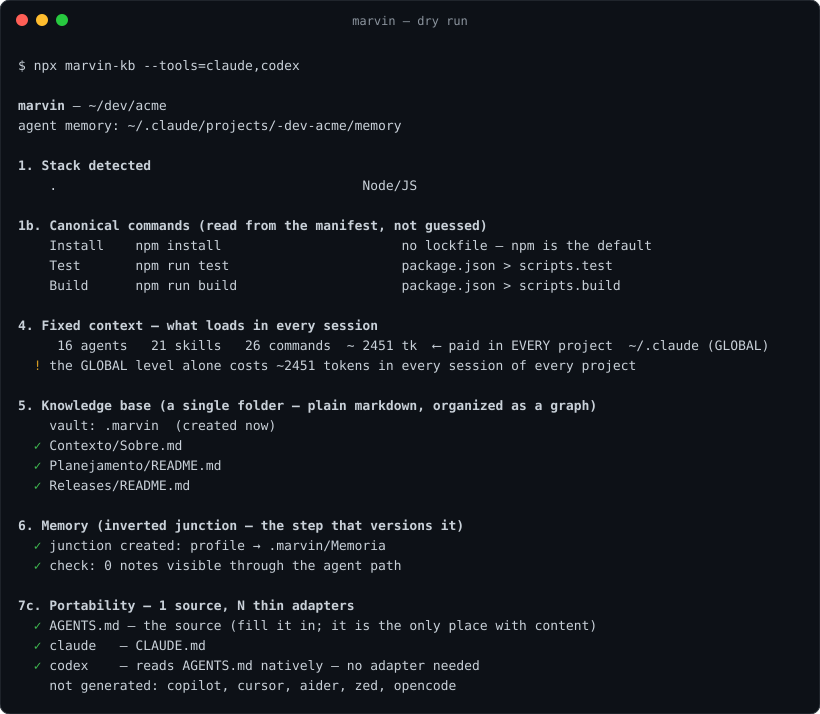

<div align="center">

<br>


# Marvin

**One `AGENTS.md`, N thin adapters, memory versioned inside the repo.**<br>
Scaffolds a project's knowledge base for working with AI agents — and survives switching tools.

[](https://www.npmjs.com/package/marvin-kb)
[](https://github.com/Josuebmota/Marvin/actions/workflows/teste.yml)


[](LICENSE)

**English** · [Português](README.pt-BR.md)

```bash
npx marvin-kb --tools=claude,codex
```



</div>

Not a framework. Nothing runs in the background. No dependencies. It's a ~1810-line Node
script that creates a structure and gets out of the way.

> **Why this exists.** Not to invent anything — tools that do this already exist, and in
> more mature forms. Marvin is a learning project: on paper it makes no sense to build what
> the market already ships; in practice, building is how you understand why things are the
> way they are. Use it if it fits; steal the ideas if it doesn't.

| | |
|---|---|
| 🧭 **One source of truth** | all durable content in `AGENTS.md`; each tool gets a 15-line pointer |
| 🧠 **Memory in git** | an inverted junction makes the agent's memory land inside `.marvin/` |
| 🔁 **Idempotent** | run it twice, nothing duplicates or gets overwritten |
| 🔍 **Diagnostics** | fixed-context cost per session, empty "services", junk in the root, canonical commands read from the manifest |
| 🔌 **Optional tools** | `graphify` code graph and `ponytail`, recorded in `.marvin/ferramentas.md` — never required |

> **The package is `marvin-kb`, the command is `marvin`.** `marvin` was already taken on
> npm, so `npx marvin` would fetch someone else's package — use `npx marvin-kb`. After
> `npm i -g marvin-kb` the command on your PATH is just `marvin`.

Or clone it and run the file directly — it's a single script with no dependencies:

```bash
node /path/to/marvin/marvin.mjs --tools=claude,codex
```

<details>
<summary><b>Table of contents</b></summary>

- [The problem](#the-problem)
- [How it solves it](#how-it-solves-it)
- [What it creates](#what-it-creates)
- [Where the knowledge base lands](#where-the-knowledge-base-lands--and-why-it-isnt-always-marvin)
- [What it deliberately does NOT do](#what-it-deliberately-does-not-do)
- [Agent, skill, or command?](#agent-skill-or-command)
- [Tools](#tools)
- [Diagnostics](#diagnostics)
- [Flags](#flags)
- [Upgrading a project that's already set up](#upgrading-a-project-thats-already-set-up)
- [`--graphify`](#--graphify--queries-no-hook)
- [Related: Anthropic's `claude-code-setup`](#related-anthropics-claude-code-setup)
- [Requirements](#requirements) · [Tests](#tests) · [Contributing](#contributing) · [License](#license)

</details>

## The problem

Every AI tool wants your project context in its own format: `CLAUDE.md`,
`.cursor/rules/`, `CONVENTIONS.md`, `AGENT.md`, `AGENTS.md`. Use more than one and you end
up with the same content in N places — and **N copies diverge**. By week three one of them
is lying, and the agent believes it.

Worse: agent memory usually lives in your user profile, outside the repository. Not in
git, not backed up, gone when the machine dies.

## How it solves it

**One source, N thin adapters.** All durable content lives in `AGENTS.md` — the standard
that Codex, Cursor, Aider, Zed and opencode read. Each tool's file is a **15-line
pointer** with no content of its own. Divergence becomes structurally impossible.

**Memory inside the repository, via an inverted junction:**

```
~/.claude/projects/<path>/memory  ──junction──►  .marvin/Memoria/
```

The tool writes to its own default path; the files are born inside the repository. Memory
as plain markdown inside the project, one source. Switch tools and **the files stay** —
only the auto-loading goes away.

## What it creates

```
<project>/
├── AGENTS.md                   source of truth — all durable content
├── CLAUDE.md                   adapter (only if you pick claude)
├── .cursor/rules/projeto.mdc   adapter (only if you pick cursor)
├── .claude/
│   ├── agents/README.md        guide for writing your team
│   ├── skills/README.md        skill vs. agent vs. command: the discriminator
│   └── commands/retomar.md     /retomar: the entry point
└── .marvin/                    ← knowledge base, organized as a GRAPH
    ├── Contexto/               what the project IS
    │   ├── Sobre.md            root node — links to the flows
    │   ├── Fluxos/             one .md per flow; born when a flow gets analyzed
    │   ├── Arquitetura/        how it is built; structural decisions live here
    │   └── Design/             only when a front-end is detected
    ├── Planejamento/           what is being DONE: <Epic>/<Feature>/<US>/Sobre.md
    │   ├── Manutencao/         every node has the same Sobre.md: state, parent, Rumo
    │   └── Novos/
    ├── Fontes/                 support; Externas.md says what lives outside the repo
    ├── Releases/               <version>.md — index of what shipped, with evidence
    └── Memoria/
        └── onde_paramos.md     the only door; pointers to the active USs, nothing else
```

Two axes: what the project **is** (`Contexto/`) and what is being **done** to it
(`Planejamento/`). Every node is a `Sobre.md` with `estado` in the frontmatter, a link to
its parent and a **Rumo** section — one entry per change of direction. Decisions live in
the node that made them: a US decision in the US, a structural one in `Arquitetura/`.
Nothing moves folders when done: the US gets `estado: concluida`, its evidence, and a line
in `Releases/`. **Links are edges**: with `--graphify`, the knowledge base joins the code
graph, and `graphify affected "<function>"` answers which US and which code depend on it.

The generated `Planejamento/README.md` carries the rule that repeats **before any US** (`AGENTS.md` only points to it — a rule lives where it fires): map what the
activity touches, propose its team in layers (`tl`, `po` · `dev-front`, `dev-back`, `qa` ·
`scout`, plus `design`/`dba`/`sec`/`infra` when the activity asks), propose the skills it
will repeat, and update the agents with what this activity taught — append, never rewrite.

> Generated file and folder names are in Portuguese, matching the templates the script
> ships. They are yours to rename — nothing in the script depends on the names except the
> markers below.

## Where the knowledge base lands — and why it isn't always `.marvin`

The script **looks for an existing base by its markers** (`Memoria/`, `08_Memoria/` or `.obsidian/`),
not by folder name. The rule:

| Situation | Result |
|---|---|
| New project | creates **`.marvin/`** |
| A base already exists in `.docs/`, `Docs/` or `docs/` | **reuses it**, no duplicate |
| A `Docs/` exists that is **not** a base (product documentation) | creates `.marvin/` alongside and says: *"living next to product Docs/ — untouched"* |

**The name says whose folder it is.** In most repositories this tool runs in — a client's
code, an employer's, a team's — this base is *your working material*, not a project
deliverable. A generic `.docs` suggested the opposite and invited being committed along
with the product. `.marvin` makes its origin and its audience explicit.

`.docs` stays in the candidate list, so **a project set up by an earlier version keeps
working with no migration** — detection is by marker, not by name. And if the project's
`Docs/` is already where knowledge lives, merging still beats separating: two bases that
can't see each other is the worst outcome.

**Practical consequence:** migrated projects tend to sit in `Docs/`, new ones in `.marvin/`.
That's the design, not an inconsistency. Only rename if the folder is **100% tooling** —
and if you do rename it, **rebuild the junction**, because it still points at the old path
and goes orphaned silently:

```powershell
# PowerShell — removes ONLY the link, never the content
[System.IO.Directory]::Delete("$env:USERPROFILE\.claude\projects\<path>\memory", $false)
git mv Docs .marvin
New-Item -ItemType Junction -Path "$env:USERPROFILE\.claude\projects\<path>\memory" `
         -Target "$PWD\.marvin\Memoria"
```

Then update the references to `Docs/` in `AGENTS.md`, in the tool adapter, in
`retomar.md`, and in the memory notes.

## What it deliberately does NOT do

**It doesn't write your agents, and it doesn't write the body of `AGENTS.md`.** That
requires knowing the project's traps, and a generic agent is worse than no agent.
`PROMPT.md` carries the prompt that guides this part.

The difference between an agent that helps and one that gets in the way isn't the role
description — it's the concrete trap written inside it. `"you are a senior React dev"` is
worth nothing; `` "`account.balance` is the opening balance, not the displayed one" ``
prevents a bug.

Same for skills: the script creates the folder and the guide, **no skills**.

## Agent, skill, or command?

The scaffold ships the discriminator, because getting this wrong is common:

|  | Where the text loads | Who uses it |
|---|---|---|
| **Agent** | its **own clean** context | spawned, isolated |
| **Skill** | the **current** context | whoever invokes it |
| **Command** | current context | **you** trigger it |

> **A fact the subagent must know** → in the agent's `.md`.
> **A procedure 2+ roles run** → skill.
> **Something you trigger** → command.

**The catch:** a subagent starts with a clean context. It doesn't read `AGENTS.md`, doesn't
read the adapter, and doesn't read skills — unless it has the `Skill` tool in its list. So
**repeating a critical fact inside every agent that needs it isn't sloppiness, it's the
only way.** What must not be repeated is *procedure*.

**Cost rule:** a new skill only after the procedure has run **twice**. Every skill's
description loads in every session — thirty skills become the problem skills were supposed
to solve.

## Tools

| Flag | Generates | Confidence |
|---|---|---|
| `codex`, `opencode` | nothing — they read `AGENTS.md` natively | high |
| `claude` | `CLAUDE.md` + `/retomar` | high |
| `copilot` | `.github/copilot-instructions.md` | high |
| `cursor` | `.cursor/rules/projeto.mdc` | **medium** |
| `aider` | `CONVENTIONS.md` | **medium** |
| `zed` | `AGENT.md` | **low** |

GitHub Copilot's agent also reads `AGENTS.md` anywhere in the repo, but chat and code
completion don't — that's why the pointer file is generated anyway.

Medium and low confidence adapters ship with a warning at the top telling you to verify
the current convention. **An adapter that doesn't load fails silently** — worse than no
adapter at all.

Running again with a different list **adds** what's missing; nothing is removed.

### Optional tools — the `.marvin/ferramentas.md` record

Some tools are not adapters but things a project *chooses* to use. marvin detects them
on PATH, asks **once** (only with a terminal — without one it records `não` and warns),
and writes the answer to `.marvin/ferramentas.md`. Later runs read the record instead of
asking. Flip it with `--use=<tool>`; `--no-questions` records `não` even with a terminal.

| Tool | What it produces | Reach |
|---|---|---|
| `graphify` | `graphify-out/graph.json` — the code graph, see [below](#--graphify--queries-no-hook) | **any agent** reads the JSON/markdown; only the hook is Claude-specific, and it is not installed |
| `ponytail` | a simplicity ladder for whoever *implements* — a `## Ferramentas` section in `AGENTS.md` (confidence **low**: installed and read, not measured) and a role table in `.claude/agents/README.md` (dev yes; `tl`/`po`/`scout` no) | plugin with hooks in **Claude Code, Codex and Copilot CLI** (each has its own install; marvin detects only the Claude one, telling *installed* — `~/.claude/plugins/installed_plugins.json` — from *active* — `~/.claude/.ponytail-active`); Cursor takes its hooks (`~/.cursor/hooks.json`) or its rule file, neither generated; everyone else copies the rule file from the ponytail repo |

*Reach* is the column that matters: it says who can consume what the tool produces.
A tool whose output only one agent reads is a decision, not a default.

## Diagnostics

Beyond creating things, it points out problems that slip by:

- **Real stack per directory** — doesn't trust folder names
- **Directories that look like a service but are empty** — stops you from writing an agent
  for code that doesn't exist
- **Junk in the root** — a file with a strange name is a malformed shell command, not content
- **Empty files tracked in git** — almost always junk that slipped in via `git add -A`
- **Fixed context** — counts agents, skills and commands per level and estimates how many
  tokens each `description` costs in **every** session. A heavy global level is paid in
  every project, used or not. Also warns when more than 2 levels have agents — the most
  specific one wins silently
- **Canonical commands** — reads install/test/build from the manifest (`package.json`,
  `pyproject`, `go.mod`, `Cargo.toml`, `*.csproj`, `pubspec.yaml`, `Makefile`) and takes the
  **package manager from the lockfile**. An agent that guesses runs `npm install` in a pnpm repo
- **What loads in every session** — `AGENTS.md`, the adapter (`CLAUDE.md`) and the memory
  note, each measured and summed. Measured on three real projects, `AGENTS.md` weighed more
  than the note in all of them — the earlier version measured only the note. Past ~6 KB for
  the note, or ~6000 tokens for the three, the warning comes **with a destination**: how a
  flow works goes to `Contexto/Fluxos/`, the state of a US goes to its `Sobre.md`, the log of
  what was done is already in `git log`. `--check` prints the same account
- **Leftovers from old orchestration tools** — only shows up if detected

### The dashboard — `marvin --status --html`

`--status` is the text ruler. `--html` writes the same measurement as a page,
`.marvin/.status/index.html` — a single file, no lib, no network, opens on `file://`
(the SessionStart hook regenerates it every time a session opens). Top to bottom, in the
order you need it:

1. **Fix** — every inconsistency the status found, each linked to the file. If there is
   nothing, one green line. This is the reason to open the page.
2. **Four cards** — fixed context, active USs, concluded USs, API-equivalent cost — each
   with the delta since the previous commit. They are links to the section below.
3. **In progress** — the USs from the note with a state badge and their last Rumo.
4. **Trend** — one chart, a tab per metric (fixed context, USs, graph age, cost); one point
   per commit, from `historico.jsonl`.
5. **Tokens** — per day and per model, read from the Claude Code transcripts of the project,
   with cost per turn and per day next to the total.
6. **Planning** — the whole tree, Epic › Feature › US, as collapsible nodes (open where
   something is active). Each node shows its state, its last Rumo, a link that opens the
   `Sobre.md` in a new tab, and **◎**, which opens the network and focuses that node.
7. **The network** — the knowledge base as a graph (Epic → Feature → US → flows → the
   code they touch), collapsed by default. Click a node: it gets a ring, its neighbours
   stay lit, everything else fades; click the background to clear. Double-click opens the
   file in a new tab.

The page is *derived*: it reads the nodes, it never writes them. To change a node, edit its
`Sobre.md` (the link does that) — the next `--status --html` reflects it.

Light and dark follow the system; the `tema` button pins one (kept in `localStorage`).
Visual parameters (warm neutrals, monospace UI labels, tabular numbers, the .5rem grid on
panels) were read from animejs.com's stylesheet and translated to Marvin's own palette — no
font, no asset, no request leaves the file. The pixel-art hand walking the header is Thing,
drawn as SVG rects; `prefers-reduced-motion` turns it off.

**About the cost card.** Tokens are *measured*: every `usage` block of every assistant
message in `~/.claude/projects/<slug>/*.jsonl`. The dollar figure is what those tokens
**would cost at API list prices** (dated table inside the script; cache read ≈ 0.1×, cache
write ≈ 1.25×). On a fixed plan (Max) your real spend is the subscription — the card tells
you how much of the API that subscription is buying, not what you paid. Cache read is
usually ~⅔ of it: every turn re-reads the whole context.

## Flags

<details>
<summary><b>Every flag, with what it does</b></summary>

```
--tools=<list>    adapters to generate. default: claude
                  valid: claude, codex, copilot, cursor, aider, zed, opencode
                  running again with a different list ADDS what's missing
--check           diagnoses the memory mount and exits non-zero if it is broken.
                  Writes nothing. Run it after moving or renaming the project
--dry-run         print everything it would do, write nothing
--status          dashboard, read-only: active USs with their last Rumo, progress per
                  Epic, last release, the fixed-context bill, graph age. Exits non-zero
                  when the note and the nodes disagree. Run it when you open a session
   --curto        only active USs and warnings, no header, always exit 0 — the
                  SessionStart hook the scaffold writes to .claude/settings.json runs it
   --html         also writes .marvin/.status/index.html — the knowledge base drawn as a
                  network (Epic → Feature → US → flows → the code they touch, colored by
                  state; inline force layout, no lib) — and records one point per
                  commit in historico.jsonl: the trend of fixed context, USs, graph age.
                  Both read the Claude Code transcripts of the project and show the tokens
                  actually SPENT, per model — measured — plus an estimated cost (dated
                  price table) and how much of each turn is the fixed context
--us <path>       opens a US: Novos|Manutencao/<Epic>/<Feature>/<US>. Creates the
                  Sobre.md chain that is missing and adds the pointer to the note
--fechar          read-only: what changed in git (uncommitted + today's commits) and is
                  in NO active US's "Código tocado" — the map is incomplete or the work
                  leaked. /fechar runs it
--release <v>     closes the cycle: every US with estado: concluida that is in no
                  Releases/*.md goes into Releases/<v>.md (Evidência required) and
                  leaves the note. No tag, no commit — it prints the git tag to run
--migrar          old layout (08_Memoria/, 10_Decisoes/) → graph layout. Backs up,
                  moves, rewrites paths; what takes judgment is listed at the end
--clean-legacy    removes old orchestrator leftovers
--no-git          skips git init and .gitignore
--graphify        builds a code graph for structural queries (needs graphify on PATH)
                  indexes gitignored sub-repos separately, so a monorepo does not
                  end up with a graph that is missing all of its code
--graphify-label  names the graph communities with the `claude` CLI on PATH.
                  Off by default: one call at a time, so it costs minutes and quota
--graphify-rebuild  rebuilds an existing graph (the default never overwrites one)
--graphify-git-hook  writes .git/hooks/post-commit so the graph refreshes itself.
                  Never overwrites a post-commit you already have
--use=<tool>      records `sim` for an optional tool without asking (alias: --usar=)
--no-questions    records `não` for every optional tool, even with a terminal
--help, -h        usage; exits without writing
```

### The three triggers

A rule that lives in a file depends on someone remembering it. Three commands fire it:

| When | Command | What it does |
|---|---|---|
| opening a session | SessionStart hook → `marvin --status --curto --html` (also regenerates the dashboard), then `/retomar` | reads the note, follows the pointers, checks against `git log` |
| starting work | `/us <path>` → `marvin --us` | creates the `Sobre.md` chain and the pointer; the agent then maps, proposes the team and the skills |
| releasing | `marvin --release <v>` | writes `Releases/<v>.md` from the concluded USs and takes them out of the note |
| closing | `/fechar` | Rumo entry per US touched, note rewritten as pointers, agents updated in layers, `--status`, and whether it is time for a new chat |

`/retomar` and `/fechar` are the pair; `--status` is the ruler between them.

### The graph, working for you

Measured on four real projects: in 23,745 agent turns the graph was queried **twice** — both in
tests. "Query, never hook" had become "never": a structural question does not show up as a
question while you work. So the script asks, at the moments it already owns:

| When | What the graph answers |
|---|---|
| `marvin --us` (second run, with *Código tocado* filled) | **Impacto** — who depends on what the US touches (2 levels), and which other USs go through the same code. Written into the US as a derived section |
| `marvin --status` | **Collision** — two active USs touching the same function, or one touching code that depends on the other's. **Spread** — a US across 4+ communities |
| `marvin --fechar` | **Drift** — code that changed today and is in no active US's *Código tocado* |

All deterministic, no LLM. graphify did the extraction; marvin ties the answer to the node.

### After moving or renaming the project folder

The junction survives the folder it points at. Move or rename the project and it keeps
pointing at the old path, while your agent creates a **real, empty directory** at the new
one. Nothing warns you: the agent writes memory, and none of it reaches the repository.

```bash
marvin --check
```

Read-only, and the exit code is the message — so it works in a hook, in CI, or as a shell
alias. It also lists orphan junctions left behind by projects that moved. To repair, run
`marvin` normally: an empty directory sitting where the link belongs is removed and the
junction recreated. If there are notes in it, they're copied and counted first — never
deleted before the count checks out.

**Try it safely first.** The script writes into your repository *and* creates a junction
in `~/.claude/projects/`, outside it. `--dry-run` lists every operation — every folder,
every file, the junction, and `git init` — and writes nothing:

```bash
node /path/to/marvin/marvin.mjs --dry-run
```

Every disk-mutating call goes through a single shim, so a write that skipped `--dry-run`
would be a bug, not a gap. A dry run that lies is worse than no dry run.

The older Portuguese names (`--ferramentas=`, `--limpar-legado`, `--sem-git`) still work as
aliases. Renaming a flag without an alias would break anyone with a script already wired
up — which is exactly the problem the script now handles.

</details>

## Upgrading a project that's already set up

Every write is guarded by `if (!fs.existsSync(...))` — that's what makes the script
idempotent. The side effect: **a file that already exists is frozen at the version that
created it.** Set a project up in July, run the August version, and you get nothing,
because the script says "already exists" and moves on.

Running it again now checks, in each file it generates but doesn't overwrite, whether the
blocks newer versions added are present — and **reports the missing ones**. It rewrites
nothing: the file is yours and may have been edited on purpose.

There is no version file. The check reads the actual content, because a stored version
number would be one more derived artifact — and derived artifacts go stale silently.

## `--graphify` — queries, no hook

Optional and never a dependency. Builds `graphify-out/graph.json` with
[graphify](https://github.com/Graphify-Labs/graphify) to answer **structural** questions:
what calls what, type hierarchy, cross-package dependencies. That's where a graph beats
`grep` — which gives you the name, but not the relationship.

Without it on PATH the step warns and skips, changing nothing else.

<details>
<summary><b>How the graph is built, what it answers, and why there is no hook</b></summary>

**The knowledge base joins the same graph.** graphify only indexes `.md` through an LLM
(measured: 93 K tokens for three tiny files, non-deterministic, and it dropped the doc→code
edge itself as "out-of-scope"). So marvin writes the doc side by regex — relative links
become `references`, `pai:` becomes `child_of`, the backticked paths under *Código tocado*
become `touches` on the code node — and appends it straight into `graph.json`, before the
report step. Zero LLM, zero cost, same result every run; a function that no longer exists
becomes a warning, never a ghost node. The payoff is the query nobody could answer before:
`graphify affected "calcularEstorno"` → the US that touches it and the code that calls it.

### Should you use it?

Only if you ask **structural** questions often — "what calls this", "what breaks if I change
this interface", "which packages depend on which". If your questions are "where is X" or
"which file has Y", `grep` and `glob` are cheaper and always fresh. Read the measured numbers
at the end of this section before deciding.

### Installing and using it

It's a Python tool, so it installs outside npm. Either works:

```bash
uv tool install graphifyy
```

```bash
pipx install graphifyy
```

Confirm it's on PATH — if this fails, the `--graphify` step will skip:

```bash
graphify --version
```

Then build the graph from the project root:

```bash
npx marvin-kb --graphify
```

Ask it structural questions:

```bash
graphify query "what calls the payment service"
```

### What it builds

One flag runs the whole pipeline, and all of it is local AST — no API key, no cost:

```
graphify-out/
├── graph.json        the graph — this is what `graphify query` reads
├── graph.html        open in any browser, no server needed
├── GRAPH_REPORT.md   communities, hubs, freshness
└── repos/            one extraction per sub-repo (monorepos only)
```

**Monorepos are why this is more than one command.** Sub-repositories usually sit in the root
`.gitignore`, because each is versioned on its own. Graphify respects `.gitignore`, so
extracting from the root alone indexes everything *except* your code. Measured on a monorepo
with four sub-repos: 2,783 of its 2,854 nodes came from `.claude/` and **none** from the
product — and nothing along the way said so. Marvin finds the sub-repos the root ignores,
indexes each on its own, and merges them into one graph.

Community naming is the one part that needs an LLM, so by default they stay `Community 0`,
`Community 1`. Two flags cover the rest:

| flag | what it does |
|---|---|
| `--graphify-label` | names the communities with the `claude` CLI on your PATH — no API key, but graphify pins it to one call at a time, so it costs minutes and quota |
| `--graphify-rebuild` | rebuilds a graph that already exists. The default never overwrites one |

In a monorepo, **`graphify update .` is the wrong refresh command** — it re-extracts the root
only and throws the sub-repos away. Marvin writes that warning into the generated `CLAUDE.md`,
naming the sub-repos, so the agent doesn't wreck the graph by following graphify's own
instructions. The right refresh is `marvin --graphify --graphify-rebuild`.

### Refreshing it automatically

The graph ages with every commit and never says so. `--graphify-git-hook` closes that gap by
writing a `post-commit` that refreshes it in the background, so `git commit` returns
immediately.

It is **not** `graphify hook install`. That one rebuilds the *root* of the repository it's
installed in — which in a monorepo is exactly the path that drops the sub-repos from the
graph. It would automate the bug. Marvin's hook runs the refresh that fits the project:
`graphify update .` in a single repo, the full cycle in a monorepo.

Three things worth knowing before you turn it on:

- **It is never installed by default**, and it **never overwrites a `post-commit` you already
  have** — that file often holds someone's lint, changelog or CI. If one exists, Marvin prints
  the line to add by hand and touches nothing.
- **It is not versioned.** Hooks live in `.git/`, so it is per-clone and does not reach your
  team. Everyone who wants it runs the flag.
- `MARVIN_SKIP_GRAPH_HOOK=1 git commit …` skips it once. Deleting the file uninstalls it.

The same moment is the right trigger for the other derived thing that goes stale — the
memory. The generated `CLAUDE.md` says to update `onde_paramos.md` **at the commit**, and only
when the commit changes the state of the project. A typo commit asks for nothing. That note is
overwritten, never appended: the history is the `git log`.

After changing code, refresh it before trusting an answer — **it does not warn you when it's
stale**:

```bash
graphify update .
```

Running `marvin --graphify` again does not rebuild an existing graph (running twice must not
overwrite), but it does compare the graph's timestamp against the whole tree and tell you if
it went stale.

**What it deliberately does NOT do:**

- **It doesn't run `graphify claude install`.** That command installs a `PreToolUse` hook
  answering `MANDATORY: you MUST run graphify before reading` on every `Read` and `Grep` —
  and its freshness check only looks at the *target file's* mtime: it relaxes on the file
  you just edited and hardens everywhere else, including `grep`, which is how you'd
  discover the change. A stale graph carrying MANDATORY authority is worse than no graph.
- **It doesn't version the graph.** `graphify-out/` goes into `.gitignore`. A committed
  derived artifact is how it goes stale silently — and it generates merge conflicts too.
- **It doesn't index markdown.** Runs with `--code-only`: local AST only, no LLM key and no
  cost. Graphify's `.md` pass requires paid extraction.

In exchange, the step compares the graph's mtime against the **whole tree** and warns when
it's stale — the check the original hook lacks. A warning, never an order.

> **Measured gain** (195-file Python repo, 2,640 nodes): **9.3×** by graphify's own
> benchmark — not the 71× advertised — and that 9.3× is against *reading the entire
> repository*. Against targeted `grep`, the graph only pays off on structural questions:
> locating a file costs it ~1,650 tokens versus ~18 for a glob.

</details>

## Related: Anthropic's `claude-code-setup`

Anthropic ships an official plugin,
[`claude-code-setup`](https://github.com/anthropics/claude-plugins-official/tree/main/plugins/claude-code-setup),
that scans a codebase and **recommends** Claude Code automations — MCP servers, skills, hooks,
subagents, slash commands. It is read-only: it advises, it writes nothing.

The two answer different questions. That one answers *"what should I adopt?"*. Marvin answers
*"where is the skeleton?"* — it writes `AGENTS.md`, the tool adapters and the vault, mounts
agent memory **inside** the repository, and gets out of the way. It is also not Claude-only:
`AGENTS.md` is the source and each tool gets a thin adapter.

Use both. Ask that plugin what to adopt; run Marvin for the structure that holds it.

Marvin does say something about roles, but only what it can derive: the generated
`.claude/agents/README.md` names the stacks it found and tells you how many roles that
implies — one per boundary in a polyglot repo or a monorepo, two in a single-stack one. It
never writes the agents themselves. An agent without the scars of *this* codebase is fixed
context in every session that gives nothing back.

## Requirements

Node 18+. No dependencies.

**Windows** — uses a *junction*, which needs no admin rights. Primary platform.

**Linux** — tested on `node:20-alpine`. Node ignores the `'junction'` type outside Windows
and creates a directory symlink, which behaves identically: writing through the profile
path lands in the repository. Verified end to end, including memory migration (5 notes
copied, counted, profile replaced by the link) and idempotency.

**macOS** — covered by CI. It takes the same code path as Linux, and the workflow runs the
suite on `macos-latest` at every push.

## A note on language

The script's output is in English. The **generated templates** are in Portuguese — they are
the files you'll rewrite for your own project anyway, so treat them as a starting shape
rather than final text.

## Tests

```bash
node teste.mjs
```

219 checks, no dependencies, ~2 seconds. It covers the invariants that protect other
people's disks — `--help`, `--dry-run` and `--check` write nothing, running twice doesn't
duplicate, existing memory is copied and counted before the profile is replaced by the
link, and a junction broken by a moved folder is repaired instead of merely reported.
The dry-run plan is checked too: on an already-set-up project it must promise nothing.

The test is **hermetic**: it redirects `HOME`/`USERPROFILE` to a temp directory, so running
it never creates a junction in your real profile. CI runs it on Linux, Windows and macOS.

One declared gap: the migration's **abort** branch (copied fewer notes than the source) is
not tested — forcing a partial copy needs mocking or directory permissions. It's written
down in the test header rather than faked. A test that pretends to cover is worse than a
declared gap.

## Contributing

See [CONTRIBUTING.md](CONTRIBUTING.md). The short version: run `node teste.mjs`, and
read the four invariants in [AGENTS.md](AGENTS.md) before changing behaviour.

## License

MIT.
